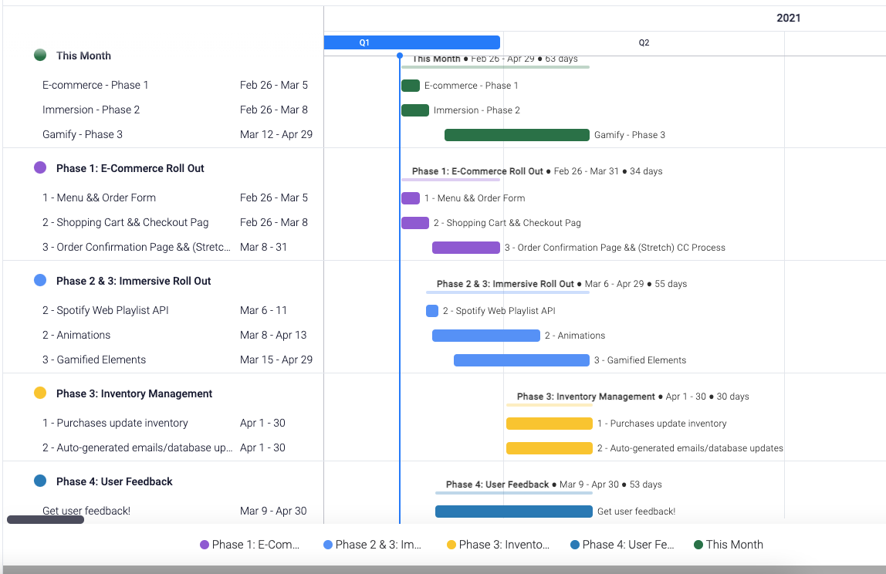

# Name of Project: Interactive Tiki Experience

## Name of Student: Danielle Thompson

## Project's Purpose

My idea is to create an immersive e-commerce site by creating a virtual, interactive tiki bar in a web application for the purpose of selling to go cocktails. (If you're in the Portland area, Hale Pele is the bar that inspired this idea.)

Obviously, covid has totally upturned my beloved service industry that I've spent so many years in, especially for bars/restaurants that are largely experiential in nature. Tiki bars are at the top of this list in my mind, as the main reason to visit one is all about the ambiance and experience - the music, the decor, the flaming drinks, the fish bowls beverage to share with friends, etc. My hope is to create a web application that helps to bridge the vast divide between customer and experience-driven bar to increase sales for such a bar during mandated quarantine.

The two major pieces of this project are then 1) the e-commerce element and 2) the immersive element.

### E-commerce

The #1 thing that this app is for is for making online sales of to go beverages. I foresee this requiring the following pages ...

- An order form
- A shopping cart
- Checkout page(s)
- Place to enter & run (stretch) a credit card
- Processing an order
- This could include emailing a client with their order (maybe a stretch goal),
- Updating a back-end database to create a new order to be fulfilled (stretch goal),
- Updating available inventory (stretch goal)

I'm starting to do some research on e-commerce templates available that are compatible with React (it looks like Bootstrap and Next.js might be viable options).

### Immersive

Nearly as important, especially if I want to make the project really stand out, is the immersive component.

I'm thinking that I want to implement parallax - to build out a kind of a 360 degree view point of a gamified, funky tiki bar front where you can "turn" to the left and see for example, a volcano that might explode or spit lava and smoke, or to the right and see a beach and ocean with a giant turtle or jumping fish. Alternatively, being able to zoom in/out on features might be another viable option, instead of a 360 degree view.

I'd like to have an ambient music toggle on the page to add in some of the kitschy noises (running on a loop) that one would hear in an in-person tiki bar (thunderstorms, monkeys, volcano blasts, etc.). If I can get to it, I want to add at least 1-3 elements on the tiki bar that would move or have their own actions upon hover or interaction (a cocktail shaker shaking, for example) to add in a gamified element. As a stretch goal, it'd be ideal to incorporate an order form into the interactive elements to be able to dynamically add items to a shopping cart while tinkering with the tiki bar. I'm still doing some research for some animation and/or game libraries that would be the best fit for this project, and have a few more leads to follow.

### MVP & Project Phases

Based on the above goals, the minimum viable product features for the whole life cycle of the project are the following:

- E-commerce site, with at least ...
  - an order form,
  - a shopping cart,
  - a checkout page, and
  - an order confirmation page.
- Immersive elements that ...
  - loop ambient music that can be paused/played, and
  - animated and/or gamified elements (1-3 total for MVP) that animate/act upon user interaction.
    - e.g. volcano explosions, smoke
    - Cocktail shaker shaking upon user hover/click
    - Tropical thunderstorm that gets triggered upon doing X thing on the page

For the class five-day project, however, the MVP features outlined above realistically would be quite wieldy to accomplish. For the purposes of the class presentation and to consider what would be most important to a potential client, I will focus on the building out functionality for the actual selling of merchandise/products and roll out additional immersive and gamified features over time.

_**Therefore, the MVP goals for the class project (phase 1) are the following:**_

- Menu & order form
- Shopping cart
- Checkout page
- Using Spotify Web Playlist API for looping tiki playlist
- Crisp, tiki-themed UI/UX

The more complete product life cycle will follow a schedule akin to the rough draft below.

### Tools, frameworks, libraries, APIs, modules and/or other resources

React seems like a great tool for this app, likely with lots of Javascript and CSS/Sass.
I might need an API if I can build out a database to support an inventory system around drinks available and orders getting added to a queue, etc.
An e-commerce library, for example through Bootstrap's e commerce library or that of Next.js.
Parallax capabilities for 3+ viewports for "game" interaction.
An animation/gamified library, maybe anime.js, likely Framer motion, etc.
A React audio player (e.g.React player, React h5 audio player, YouTube API)
I really want to keep this simple and find a single YouTube video that has maybe an hour or so of ambient "tiki" noises that can repeat, save for when a thunderstorm gets triggered.
I'd like to try to use Sass with React for any CSS styling.

## If you finish developing the minimum viable product (MVP) with time to spare, what will you work on next? Describe these features here:

- Running a credit card for orders
- Back-end inventory system for users to be alerted on the DOM if items are out of stock, an auto-generated email sent to a customer with the details of their new order, adding a new order to the bar's order queue, and updating existing inventory for the bar after each purchase is made.
- More gamified elements.
- Seeking out user/customer feedback from folks who have actually purchased craft cocktail kits from me in the last year to make product improvements.
- What additional tools, frameworks, libraries, APIs, or other resources will these additional features require?

Note: The (stretch) inventory system is a component I definitely need to do more research on, but might dove tail on existing infrastructure with whatever e-commerce library I end up using.

## Anything else you'd like your instructor(s) to know:

Obviously, some of the tools/frameworks/libraries that could come into play will need more clarification, but I'm hoping to start getting those pieces of the puzzle more solidified this week. Additionally, I plan on doing some wireframing this week to at least get some basic sketches/wireframes together for the user interface. The project itself might be a tall order, but I believe that if I start chipping away at some of my planning and research early like I've already been doing, I will be able to accomplish a good portion of my goals.
