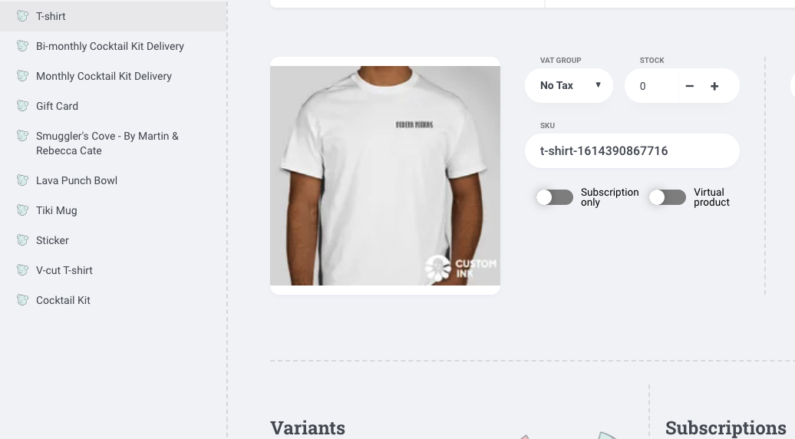

# Work Log

>>2.26.21

---

|  Time 	|  Task 	|
|---	|---	|
|  8:15am 	|  Begin work log & create new local capstone folder. 	|
|  8:20am 	|  Create GitHub repository for first draft of capstone materials, with MIT LICENSE file. 	|
|  >>8:30am 	|  Informational interview/mentor check in with Kent Lottis at Nordstrom. 	|
|  9:05am 	|  Back at it - add project proposal to .md file.	|
|  9:27am 	|  Set up process management system with Monday, integrate to GitHub repo, & create life cycle rough draft. 	|
|  10:35am 	|  E-commerce template research - Next.js focus. 	|
|  11:20am 	|  Create Technology_notes.md file for pros/cons list on potential technologies to use. 	|
|  11:35am 	|  Crystallize research, especially on order API. 	|
|  11:55am 	|  Create Crystallize [account](https://pim.crystallize.com/) & join the Slack community.	|
|  12:05pm 	|  - Create Vercel, BigCommerce accounts to clone Next.js Ecommerce [repo](https://github.com/danitcodes/vercel-ecommerce/tree/master/pages/api/bigcommerce). 	|
|  >>12:15pm 	|  Leave for lunch.	|
|  1:15pm 	|  Back at it from lunch. Create new Crystallize project `npx @crystallize/cli`.	|
|  1:45pm 	|  Familiar with Crystallize Product Information Management (PIM) Catalog & start adding products - issued with EUR default, need to fix.	|
|  2:15pm 	|  Save product and styling images for use in Crystallize PIM & website UI.	|
|  >>2:30pm 	|  Informational interview w/April Leonard at GitHub.	|
|  3:15pm 	|  Back at it. Mobile prototype/web wireframe research.	|
|  4:30pm	|  Fix default currency in Crystallize db and add to catalogue product details.	|
|  4:45pm	|   Work on project README bones to get more clear on objectives. Add gift card and subscription options bones to Crystallize.	|
|  5:00pm	|   Add pictures, prices, & size attributes to product catalog in Crystallize, add new product catalog items, create Modern Potions logo tees for catalog. Add MP logo to README & img folder.	|
|  6:15pm	|   Clock out.	|

---

>>3.1.21

|  Time 	|  Task 	|
|---	|---	|
|  8:00pm 	|  Test wireframing with Framer. 	|
|  9:00pm 	|  Work on fixing build error and further familiarizing with pre-built code, Next.js documentation, and setting up Next.js in project. 	|
|  9:30pm 	|  >>Clock out. 	|

---

>>3.5.21

|  Time 	|  Task 	|
|---	|---	|
|  8:15am 	|  Researching Spotify Web Playlist API integration to UI. 	|
|  8:30am 	|  Work on getting Crystallize API keys into the correct .env files as per Next.js security standards. Likely will need to switch out of standard demo api to correctly deploy catalogue. 	|
|  9:08am 	|  Watch and follow along with Crystallize [tutorial](https://www.youtube.com/watch?v=2ODHiq8yZjw&t=119s) for setting up website. 	|
|  9:23am 	|  Reorganize Crystallize store into Shop folder with Beverages and Merch subfolders. Create _frontpage-2021 folder too to continue structuring content.	|
|  10:00am 	|  Re-clone a boilerplate project with appropriate tenant information. 	|
|  10:14am 	|  Update README installation instructions and technology list, continue watching Crystallize tutorial. Re-clone troubleshooting. 	|
|  11:00am 	|  >>Step away for errands and lunch. Deal with internship rankings. (Bad brain focus day. >.<)	|
|  1:00pm 	|  >>Job search coaching hour with Kaila. 	|
|  2:00pm 	|  Back to Crystallize ecommerce tutorials, adding more images, assets, documents for rendering, and organization to PIM catalogue for launch preparation. 	|
|  3:20pm 	|  Track down more photo assets - especially tropical themed craft cocktails. 	|
|  3:40pm 	|  Familiarize with documents and grids, and create three grids for products, single cocktails, and merch. 	|
|  4:30pm 	|  Add additional document shapes for banners, carousels, and about components. 	|
|  5:00pm 	|  >>Career services gear switch. 	|

---

>>3.7.21

|  Time 	|  Task 	|
|---	|---	|
|  12:15pm 	|  Work on fixing npm err code 1 by downgrading to npm v6.14.9. Get tenant & env ids into appropriate places for front page build. 	|
|  1:00pm 	|  Build out front page. Research adding in Spotify Player - begin new branch to attempt implementing feature. Follow tutorial to implement spotify api with next.js [here](https://leerob.io/blog/spotify-api-nextjs).	|
|  2:15pm 	|  Successfully call Spotify API with Postman. Work on getting refresh token for [Spotify](https://developer.spotify.com/documentation/general/guides/authorization-guide/#list-of-scopes) Authorization Code Flow.	|
|  3:15pm 	|  Omg Spotify APIs are so dense - more research, njtest/ subfolder (temporarily hidden b/c security keys are not yet secured) from Spotify's web API [example repo](https://github.com/spotify/web-api-auth-examples). Have to re-init capstone folder with Spotify repo clone. Accidentally add insecure files. Have to remove files from GitHub push. Lots of failed in-app testing.	|
|  4:30pm 	|  This ish is TOO COMPLICATED RIGHT NOW. Try out a more vanilla version of using Spotify Web API based on [this tutorial](https://www.youtube.com/watch?v=1vR3m0HupGI) in spotify-web-api/ subfolder. Add dotenv for env key processing to secure app.	|
|  5:30pm 	|  Much wailing & gnashing of teeth with new tutorial. Form not showing. Fixed that eventually. Could get to "agree" to spotify conditions for login page upon form submission, but redirect page is failing despite several changes. WIP 	|
|  6:25pm 	|  Fix redirect problem in separate folder after closing down multiple open servers and fixing redirect uri. 	|