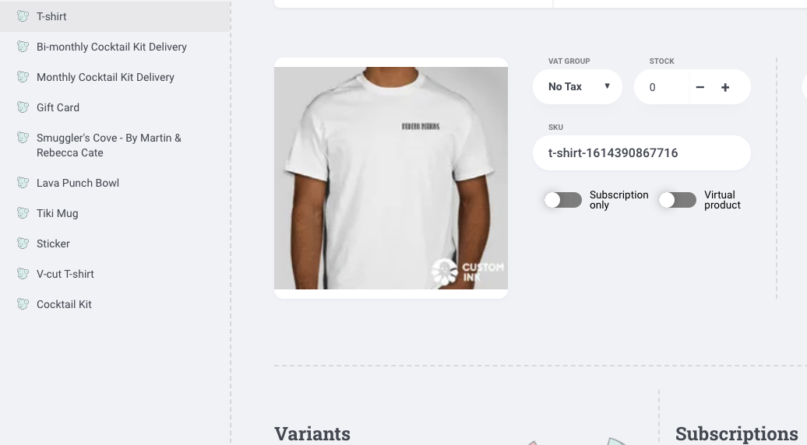

# Work Log

>>2.26.21

---

|  Time 	|  Task 	|
|---	|---	|
|  8:15am 	|  Begin work log & create new local capstone folder. 	|
|  8:20am 	|  Create GitHub repository for first draft of capstone materials, with MIT LICENSE file. 	|
|  >>8:30am 	|  Informational interview/mentor check in with Kent Lottis at Nordstrom. 	|
|  9:05am 	|  Back at it - add project proposal to .md file.	|
|  9:27am 	|  Set up process management system with Monday, integrate to GitHub repo, & create life cycle rough draft. 	|
|  10:35am 	|  E-commerce template research - Next.js focus. 	|
|  11:20am 	|  Create Technology_notes.md file for pros/cons list on potential technologies to use. 	|
|  11:35am 	|  Crystallize research, especially on order API. 	|
|  11:55am 	|  Create Crystallize [account](https://pim.crystallize.com/) & join the Slack community.	|
|  12:05pm 	|  - Create Vercel, BigCommerce accounts to clone Next.js Ecommerce [repo](https://github.com/danitcodes/vercel-ecommerce/tree/master/pages/api/bigcommerce). 	|
|  >>12:15pm 	|  Leave for lunch.	|
|  1:15pm 	|  Back at it from lunch. Create new Crystallize project `npx @crystallize/cli`.	|
|  1:45pm 	|  Familiar with Crystallize Product Information Management (PIM) Catalog & start adding products - issued with EUR default, need to fix.	|
|  2:15pm 	|  Save product and styling images for use in Crystallize PIM & website UI.	|
|  >>2:30pm 	|  Informational interview w/April Leonard at GitHub.	|
|  3:15pm 	|  Back at it. Mobile prototype/web wireframe research.	|
|  4:30pm	|  Fix default currency in Crystallize db and add to catalogue product details.	|
|  4:45pm	|   Work on project README bones to get more clear on objectives. Add gift card and subscription options bones to Crystallize.	|
|  5:00pm	|   Add pictures, prices, & size attributes to product catalog in Crystallize, add new product catalog items, create Modern Potions logo tees for catalog. Add MP logo to README & img folder.	|
|  6:15pm	|   >>Clock out.	|
|  7 hrs	|   TOTAL	|

---

>>3.1.21

|  Time 	|  Task 	|
|---	|---	|
|  8:00pm 	|  Test wireframing with Framer. 	|
|  9:00pm 	|  Work on fixing build error and further familiarizing with pre-built code, Next.js documentation, and setting up Next.js in project. 	|
|  9:30pm 	|  >>Clock out. 	|
|  1.5hrs 	|  TOTAL 	|

---

>>3.5.21

|  Time 	|  Task 	|
|---	|---	|
|  8:15am 	|  Researching Spotify Web Playlist API integration to UI. 	|
|  8:30am 	|  Work on getting Crystallize API keys into the correct .env files as per Next.js security standards. Likely will need to switch out of standard demo api to correctly deploy catalogue. 	|
|  9:08am 	|  Watch and follow along with Crystallize [tutorial](https://www.youtube.com/watch?v=2ODHiq8yZjw&t=119s) for setting up website. 	|
|  9:23am 	|  Reorganize Crystallize store into Shop folder with Beverages and Merch subfolders. Create _frontpage-2021 folder too to continue structuring content.	|
|  10:00am 	|  Re-clone a boilerplate project with appropriate tenant information. 	|
|  10:14am 	|  Update README installation instructions and technology list, continue watching Crystallize tutorial. Re-clone troubleshooting. 	|
|  11:00am 	|  >>Step away for errands and lunch. Deal with internship rankings. (Bad brain focus day. >.<)	|
|  1:00pm 	|  >>Job search coaching hour with Kaila. 	|
|  2:00pm 	|  Back to Crystallize ecommerce tutorials, adding more images, assets, documents for rendering, and organization to PIM catalogue for launch preparation. 	|
|  3:20pm 	|  Track down more photo assets - especially tropical themed craft cocktails. 	|
|  3:40pm 	|  Familiarize with documents and grids, and create three grids for products, single cocktails, and merch. 	|
|  4:30pm 	|  Add additional document shapes for banners, carousels, and about components. 	|
|  5:00pm 	|  >>Career services gear switch. 	|
|  6.75 hrs 	|  TOTAL 	|

---

>>3.7.21

|  Time 	|  Task 	|
|---	|---	|
|  12:15pm 	|  Work on fixing npm err code 1 by downgrading to npm v6.14.9. Get tenant & env ids into appropriate places for front page build. 	|
|  1:00pm 	|  Build out front page. Research adding in Spotify Player - begin new branch to attempt implementing feature. Follow tutorial to implement spotify api with next.js [here](https://leerob.io/blog/spotify-api-nextjs).	|
|  2:15pm 	|  Successfully call Spotify API with Postman. Work on getting refresh token for [Spotify](https://developer.spotify.com/documentation/general/guides/authorization-guide/#list-of-scopes) Authorization Code Flow.	|
|  3:15pm 	|  Omg Spotify APIs are so dense - more research, njtest/ subfolder (temporarily hidden b/c security keys are not yet secured) from Spotify's web API [example repo](https://github.com/spotify/web-api-auth-examples). Have to re-init capstone folder with Spotify repo clone. Accidentally add insecure files. Have to remove files from GitHub push. Lots of failed in-app testing.	|
|  4:30pm 	|  This ish is TOO COMPLICATED RIGHT NOW. Try out a more vanilla version of using Spotify Web API based on [this tutorial](https://www.youtube.com/watch?v=1vR3m0HupGI) in spotify-web-api/ subfolder. Add dotenv for env key processing to secure app.	|
|  5:30pm 	|  Much wailing & gnashing of teeth with new tutorial. Form not showing. Fixed that eventually. Could get to "agree" to spotify conditions for login page upon form submission, but redirect page is failing despite several changes. WIP 	|
|  6:25pm 	|  Fix redirect problem in separate folder after closing down multiple open servers and fixing redirect uri. 	|
|  6:50pm 	|  Added more fxns to fetch access token, request & handle Spotify authorization, handle redirects to include local storage keys and a clean redirect URL. WIP - running up against a POST api problem - error 405 code. 	|
|  7:15pm 	|  Run incident triage and log upon receiving GitGuardian email about accidentally pushed Spotify keys. Keys are all invalid now, but security checks for connected accounts etc were performed anyways.	|
|  8:15pm 	|  >>Break.	|
|  9:15pm 	|  Spotify POST troubleshooting cont. No luck (yet) - POST request fails with 400 error code.	|
|  10:30pm 	|  WIP -begin to switch gears back to integrate react-spotify-player to embed a widget instead of using the Spotify API.	|
|  11:00pm 	|  >>Clock out.	|
|  9hr 45m 	|  TOTAL	|

---

>>3.8.21

|  Time 	|  Task 	|
|---	|---	|
|  8:30am 	|  >>Standup.	|
|  9:30am 	|  Research adding in animations with react-spring using Next.js. (Btws - it's not straightforward. See [here](https://ironeko.com/posts/animating-page-transitions-in-nextjs-for-capacitor/))	|
|  10:20am 	|  GET SPOTIFY PLAYLIST WIDGET ON DOM - the easy way, no react-spotify-player needed!!! 🎉 	|
|  10:30am 	|  Start re-watching Crystallize tutorial. Begin watching middleware/Service API [tutorial](https://www.youtube.com/watch?v=Jse0uSn2Pps&list=PLiKqsi6CxPy4_za4hNzV4N079OUGeF292&index=3) 	|
|  11:20am 	|  Build out splash page in PIM. Start watching Vectr tutorial for Modern Potions logo creation. Create Modern Potions typography logo.	|
|  12:15am 	|  >>Lunch.	|
|  12:45pm - 3:45pm 	|  Back at it. Detail work on splash page. Research on how to incorporate PIM "grids" into splash, find an SVG image generator for free online, generating and adding (WIP) social media icon links, tinker with spotify player placement, etc.	|
|  3:45pm 	|  >>Career services mtg.	|
|  4:15pm 	|  UI research - color palette work, page animation refresher course, next.js styling research, tropical theme background planning.	|
|  5:05pm 	|  >>Break.	|
|  7:00pm 	|  Back at it. Canva designing hopeful background for site based on [this pattern](https://dribbble.com/shots/14401526-Tropical-Floral-Seamless-pattern). Tropical background created, but research making svg images into React page backgrounds is dense, several implementations with svg & png have not been successful - WIP. Update unicorn juice photo & N/A price in PIM. Make README more legit with proper description, detailed setup instructions (WIP for Crystallize account info), dropdowns with code snippets, add and size images, add stretch goals, user stories.	|
|  10:00pm 	|  >>Clock out.	|
|  11 hours 	|  TOTAL	|

>>3.9.21

|  Time 	|  Task 	|
|---	|---	|
|  8:30am 	|  Getting started. Fight with grids and shapes more. Add to content descriptions, summaries, photos, variants, subscriptions, etc.	|
|  9:42am 	|  Problems with saving content for subscriptions in PIM. Adding lots of single beverages - spirit-free & spirit-full. Add stretch goals.	|
|  11:16am 	|  Adding topic tags (content mapping) to all beverages for spirit-free vs spirit-full. Fixing duplicate images. Getting content to match in beverages layout. Copy writing content. Adding spirit-free options & subscriptions. Update clothing merch variants, and add topic tags to merch.	|
|  12:00pm 	|  Work on fixing "Add to basket" button error - currently not adding products. Need to locate secret tokens and such for .env file. Update - will need to connect to Crystallize's service-api.	|
|  12:15pm 	|  >>Pause for lunch & internship cover letters.	|
|  2:20pm 	|  Fix broken .env keys that were breaking site 👹. Research & work on getting API keys in for basket & order form to work correctly. Begin [presentation](https://docs.google.com/presentation/d/1bmV2Jmd01ARItux_eN7TghBWJ35dmcxvHMe5r5wT_o8/edit?usp=sharing). Add to stretch goals.	|
|  4:00pm 	|  Q&A meeting with Shawn to discuss README instructions.	|
|  4:30pm 	|  Back to presentation work. Finish presentation (save for polishing and maybe one slide if I have time).	|
|  7:00pm 	| >>Clock out. 	|
|  8:00pm 	| Polish presentation with notes, better whitespace, graphics, etc. But it's done now! Save for some practice. 	|
|  9:00pm 	| >>Clock out for real. 	|
|  9.35hrs 	| TOTAL 	|

>>3.10.21

|  Time 	|  Task 	|
|---	|---	|
|  8:30am 	|  Add total hours in worklog up.	|
|  9:00am 	|  >>Cover letters, errand.	|
|  10:30am 	|  Research & work to get Order API connected. Maybe Core API too. API endpoint testing in Postman. PayPal integration research, starting work. 	|
|  12:00pm 	|  Work on integrating order and search APIs.	|
|  1:00pm 	|  Reading deeper in the docs to decipher PIM concepts and hopefully glean more info about API usage.	Create 'about' page content. |
|  2:30pm 	|  Try again to fix welcome/about/carousel links at bottom of splash - no luck improving, so removed.	|
| 3:15pm 	|  >>Finish final cover letter.	|
| 3:45pm 	|  🎵 Werk, werk, werk, werk, werk.🎵 Add a contact us page with social media and email links. **Finally** figured out how to use grids - blerg.	Next.js research & reading next-SEO [docs](https://github.com/garmeeh/next-seo)  |
| 4:45pm 	|  Page testing & improving. Footer change & style. Add more graphics to pages. Update splash page. |
| 8:05pm 	|  Work on deployment with Vercel. SITE SUCCESSFULLY DEPLOYED. Set up Vercel analytics. Read up on Vercel docs. |
| 9:30pm 	|  Crystallize video on [gift cards & vouchers](https://www.youtube.com/watch?v=O4AbnLXwlTg&t=1s). Dig into Crystallize Slack channel for info about service API integration/boilerplates. Find service API [boilerplate code](https://github.com/CrystallizeAPI/service-api-boilerplate.git), clone down, & add to project. Add hours. |
| 10:00pm 	|  >>Clock out.	|
|  11.5hrs 	| TOTAL 	|

---

|  Total Time 	|
|---     	|
|  45.05	|